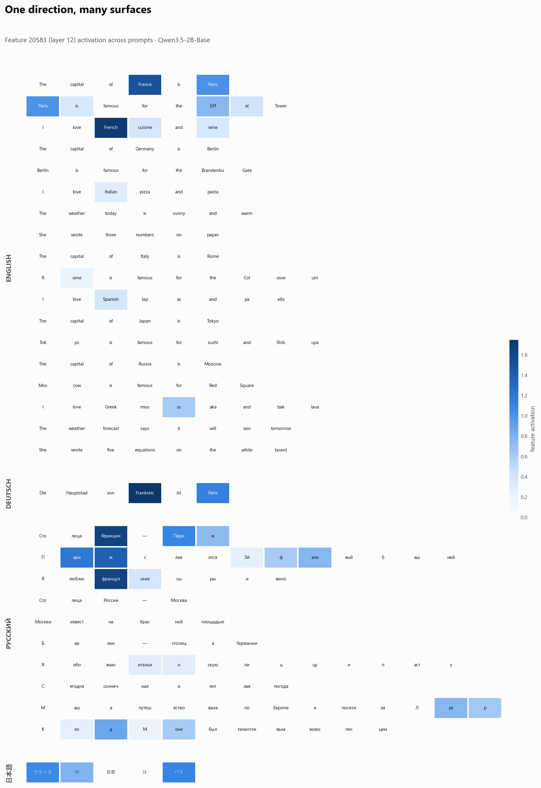

# A "France direction" inside Qwen3.5-2B

A single sparse-autoencoder feature — **layer 12, feature 20583** — that activates on
the *concept* of France: across languages, across writing systems, and on cultural
markers that never name the country.

<picture>
  <source media="(prefers-color-scheme: dark)" srcset="figures/heatmap_france_dark.png">
  <source media="(prefers-color-scheme: light)" srcset="figures/heatmap_france.png">
  
</picture>

## Why this exists

Sparse autoencoders promise a legible vocabulary for what a model represents. This
repo takes that promise down to a single object and checks it end to end: one feature,
one concept (France), traced from "does it fire on the concept regardless of language
or script" to "does editing it change what the model writes". The honest answer is yes
to reading and no to control, and both halves are written down, not just the flattering
one. It doubles as a compact, reproducible template for probing any other concept
feature the same way.

## TL;DR

- **Language- and script-independent.** Fires on *France*, *Frankreich*, *Франции*,
  *フランス*: four languages, three scripts. The concept is not stored as a string.
- **Cultural, not lexical.** Fires on *«Лувр»* in a Russian sentence about traveling
  around Europe that mentions neither France nor Paris, where the word *Europe* itself
  scores a flat zero. Also on *"the Eiffel Tower"*, though that sentence does say
  "Paris", which makes it the weaker of the two cases.
- **Specific.** Silent on the same templates about Germany, Russia, Japan; only a faint
  signal on Italy. Silent on math and weather.
- **Confirmed by direct logit attribution.** The feature promotes ` Paris` (rank 77 of
  248,320 vocabulary entries), ` Pierre`, ` France`, and suppresses ` Spanish`, ` German`.

## Method

Applies the open **[Qwen-Scope](https://huggingface.co/Qwen/SAE-Res-Qwen3.5-2B-Base-W32K-L0_50)**
top-K sparse autoencoder (`TOP_K=50`) to the residual stream of
`Qwen/Qwen3.5-2B-Base` at layer 12. A sparse autoencoder decomposes the hidden state
into a large dictionary of mostly-inactive features; we find the ones that switch on and
ask what they mean, then verify with logit attribution and causal interventions.

## Reproduce

```bash
pip install -e .                       # or: pip install -r requirements.txt
# On Colab, for CJK glyphs in the heatmap:
#   !apt-get -qq install fonts-noto-cjk

python scripts/01_reconstruction.py    # SAE sanity check (L0, rel. MSE per layer)
python scripts/02_find_feature.py      # top features on ' France' + specificity table
python scripts/03_dla.py               # direct logit attribution -> figures/dla_france.png
python scripts/04_heatmap.py           # hero figure -> figures/heatmap_france.png
python scripts/05_steering.py          # additive steering sweep (coherence window)
python scripts/06_closed_loop.py       # proportional controller on the feature
```

Runs on a single GPU (Colab T4 is enough). Generation scripts (`05`, `06`) are the slow
ones; the feature-analysis scripts (`01`–`04`) are cheap. For byte-for-byte
reproducibility, pin `MODEL_REVISION` / `SAE_REVISION` in
[`src/france_feature/config.py`](src/france_feature/config.py) and freeze
`requirements.txt`.

## Repository layout

```
src/france_feature/   package: model + SAE loading, hooks, activation capture
data/prompts.py       the prompt sets every figure and table draws from
scripts/              numbered, self-contained; 01-04 analysis, 05-06 causal
figures/              committed PNGs used by the README and write-ups
```

## Limitations (read this)

This feature is a clean **read-out** of the France concept, not a proven on/off switch.

- **Reading ≠ control.** Ablating the feature at layer 12 barely changes greedy
  generations — the model re-derives "Paris" further down the network.
- **Steering is narrow.** Additive steering stays coherent only in a small strength
  window (~+2..+4); beyond it the output degrades into fragments.
- **The heatmap is qualitative,** on curated prompts. "Looks monosemantic" is not a
  monosemanticity proof.

## Credits

Model: [Qwen3.5-2B-Base](https://huggingface.co/Qwen/Qwen3.5-2B-Base). SAE:
[Qwen-Scope](https://huggingface.co/Qwen/SAE-Res-Qwen3.5-2B-Base-W32K-L0_50). Licensed
under MIT (this repo's code).
